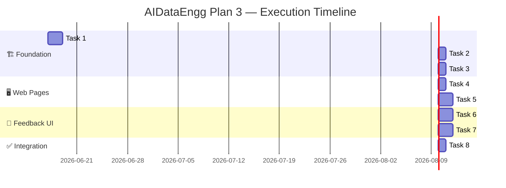

# 📡 AIDataEngg Reimagined — Shared Library + ASP.NET Host

> **IMPORTANT** This was the plan used for the execution by coding agents, things have changed since then, don't consider this as a source of truth, it's a historical artifact. The code as it is in the repo is the source of truth.

> **Plan 3** · Extends the console example into a shared library + Razor Pages app with SignalR live view  
> **Design compass** *Simple to digest. Someone reading this on GitHub should quickly learn what's happening.*  
> **UX metaphor** Webmail folders — signals as inbox folders, noise as spam, failed as bounced

---

## 🧭 Roadmap



---

## 🎯 The Three Deliverables

| # | Project | What it is | Stays? |
|---|---------|-----------|--------|
| 📦 | `src/Streamix.AIDataEngg` | Shared library — models, services, pipeline orchestrator | New |
| 🖥 | `examples/AIDataEngg` | Console app — thin host on the library | Slimmed |
| 🌐 | `examples/AIDataEngg.Web` | ASP.NET Razor Pages + SignalR — webmail-style UI | New |

---

## 🧩 Architecture at a Glance

```
┌─────────────────────────────────────────────────────────┐
│                    Host Projects                         │
│                                                         │
│  ┌─────────────────────┐   ┌──────────────────────────┐ │
│  │  examples/AIDataEngg│   │  examples/AIDataEngg.Web │ │
│  │  (Console)          │   │  (ASP.NET Core)          │ │
│  │                     │   │                          │ │
│  │  Program.cs (30ln)  │   │  Razor Pages (10x)       │ │
│  │  ───────────────    │   │  SignalR Hub             │ │
│  │  UserFeedbackSvc    │   │  _SignalNav partial      │ │
│  └────────┬────────────┘   └──────────┬───────────────┘ │
│           │                           │                 │
└───────────┼───────────────────────────┼─────────────────┘
            │                           │
            ▼                           ▼
┌──────────────────────────────────────────────────────────┐
│              src/Streamix.AIDataEngg                     │
│              (Shared Library)                            │
│                                                          │
│  ┌──────────┐ ┌────────────┐ ┌────────────────────────┐ │
│  │ Models   │ │ Services   │ │ PipelineOrchestrator   │ │
│  │───────── │ │─────────── │ │──────────────────────── │ │
│  │RssItem   │ │RssFetcher  │ │Stage 1-2: Fetch+dedup  │ │
│  │Classified│ │EmbeddingSvc│ │Stage 3:   Count unproc │ │
│  │VectorIdx │ │VectorClass │ │Stage 4-5: Embed+class  │ │
│  │Config    │ │CentroidTrk │ │Stage 6:   Summary      │ │
│  │Events    │ │FeedbackSvc │ │IProgress<PipelineEvent> │ │
│  └──────────┘ └────────────┘ └────────────────────────┘ │
│                                                          │
│  ┌────────────────────────────────────────────────────┐  │
│  │  Data / RssDbContext (SQLite via EF Core)          │  │
│  └────────────────────────────────────────────────────┘  │
│                                                          │
│  + ServiceCollectionExtensions (DI wiring)               │
└──────────────────────────────────────────────────────────┘
```

---

## 🧠 Design Decisions

| Decision | Choice | Rationale |
|----------|--------|-----------|
| **Progress pattern** | `IProgress<PipelineEvent>` | .NET built-in since 4.5. Library stays host-agnostic. Console wraps `Console.WriteLine`, ASP.NET wraps `IHubContext.SendAsync` |
| **Config storage** | Markdown files on disk | Copy-to-output, single-user. Container-friendly with volume mount. No DB schema needed for config |
| **Pipeline execution** | Hub method runs inline | `PipelineHub.StartPipeline()` calls orchestrator directly. `Context.ConnectionAborted` cancels on disconnect. No background service needed |
| **Discriminated union JSON** | Flat `{type, ...}` objects | Avoids polymorphic JSON complexity. JS client switches on `event.type` — simple and debuggable |
| **UI framework** | Razor Pages + vanilla CSS | No Blazor, no React. Familiar to any ASP.NET developer. Minimal tooling. Easy to read on GitHub |
| **Vector store** | InMemory (existing) | No infra dependency. Startup restores from SQLite. Documented swap point for production |

---

## 📋 Task Breakdown

### Task 1 · 📦 Create `src/Streamix.AIDataEngg` Library

| | |
|---|---|
| 🏷 Priority | 🔴 **High** |
| ⛓ Depends on | Nothing |
| 📤 Produces | `src/Streamix.AIDataEngg/` (18 files) |

**What & why** — Move all domain logic out of the console example into a proper library so both the console app and ASP.NET app share one codebase.

**Scope:**

```yaml
create:
  - src/Streamix.AIDataEngg/Streamix.AIDataEngg.csproj
    target: net10.0
    refs:
      - Streamix, Streamix.Extensions (project)
      - Microsoft.EntityFrameworkCore.Sqlite
      - Microsoft.Extensions.AI (+OpenAI)
      - Microsoft.SemanticKernel.Connectors.InMemory
      - System.Numerics.Tensors, System.ServiceModel.Syndication
      - Microsoft.Extensions.DependencyInjection.Abstractions
      - Microsoft.Extensions.Configuration.Abstractions

move (namespace: AIDataEngg.* → Streamix.AIDataEngg.*):
  - Models/RssItem.cs, ClassificationResult.cs, ClassifiedRssItem.cs, VectorIndexEntry.cs
  - Services/RssFetcher.cs, EmbeddingService.cs, RssClassifier.cs, VectorClassifier.cs
  - Services/CategoryCentroidTracker.cs, EmbeddingSerializer.cs, VectorStoreProvider.cs
  - Data/RssDbContext.cs, Helper.cs

add:
  - Models/PipelineConfig.cs       # Record: FeedSources, Goal, Signals, ValidSignals, SystemPrompt
  - PipelineEvent.cs               # Abstract record with 5 derived types (stage, item, count, complete, error)
  - ConfigLoader.cs                # Read/write source.md, goal.md, signals.md, prompt.md
  - IFeedbackService.cs            # Interface: list by signal, reclassify, mark not-noise, retry, more-like
  - FeedbackService.cs             # Implementation using IDbContextFactory<RssDbContext> + vector store
  - PipelineOrchestrator.cs        # 6-stage pipeline from current Program.cs, accepts IProgress<PipelineEvent>
  - ServiceCollectionExtensions.cs # AddAIDataEngg(this IServiceCollection, IConfiguration)
```

**Key signatures:**

```csharp
// PipelineOrchestrator — the heart of the pipeline
public class PipelineOrchestrator
{
    public async Task RunPipelineAsync(
        IProgress<PipelineEvent>? progress = null,
        CancellationToken ct = default);
}
```

```csharp
// PipelineEvent — progress reported as the pipeline runs
public abstract record PipelineEvent
{
    public sealed record StageChanged(string Stage, string Message, double? Progress) : PipelineEvent;
    public sealed record ItemProcessed(string Title, string Signal, string Source, int Index, int Total, bool IsNoise) : PipelineEvent;
    public sealed record CountUpdate(string Label, int Value) : PipelineEvent;
    public sealed record PipelineComplete(int Total, int Auto, int Llm, int EmbedFailures, int Noise) : PipelineEvent;
    public sealed record PipelineError(string Message) : PipelineEvent;
}
```

```csharp
// IFeedbackService — webmail-style browsing + actions
public interface IFeedbackService
{
    Task<List<ClassifiedRssItem>> ListBySignalAsync(string signal, int limit = 50, CancellationToken ct = default);
    Task<List<ClassifiedRssItem>> ListNoiseAsync(int limit = 50, CancellationToken ct = default);
    Task<List<ClassifiedRssItem>> ListFailedAsync(int limit = 50, CancellationToken ct = default);
    Task<ClassifiedRssItem?> GetByIdAsync(int id, CancellationToken ct = default);
    Task ReclassifyAsync(int classifiedId, string newSignal, CancellationToken ct = default);
    Task MarkNotNoiseAsync(int classifiedId, CancellationToken ct = default);
    Task RetryFailedAsync(int classifiedId, CancellationToken ct = default);
    Task<List<(ClassifiedRssItem Item, double Score)>> MoreLikeAsync(int classifiedId, int top = 6, CancellationToken ct = default);
    Task<Dictionary<string, int>> GetSignalCountsAsync(CancellationToken ct = default);
    Task<int> GetNoiseCountAsync(CancellationToken ct = default);
    Task<int> GetFailedCountAsync(CancellationToken ct = default);
}
```

**✅ Acceptance:**

- [ ] `dotnet build src/Streamix.AIDataEngg/` succeeds
- [ ] Existing console `--config-check` and `--smoke` still work after slimming
- [ ] `PipelineOrchestrator.RunPipelineAsync` produces same output as current inline pipeline
- [ ] No `Microsoft.AspNetCore.*` references in the library

---

### Task 2 · 🧹 Slim Down Console App

| | |
|---|---|
| 🏷 Priority | 🔴 **High** |
| ⛓ Depends on | Task 1 |
| 📤 Produces | `examples/AIDataEngg/` (slimmed, ~30 lines) |

**What & why** — The console app stays for tutorials/training. It becomes a thin shell.

**Scope:**

```yaml
update:
  - examples/AIDataEngg/AIDataEngg.csproj:
      remove: [all NuGet packages]
      add: [project ref to Streamix.AIDataEngg]
      keep: [configs/ with CopyToOutputDirectory]

rewrite:
  - examples/AIDataEngg/Program.cs → ~30 lines:
      - Host.CreateDefaultBuilder → AddAIDataEngg → build
      - Handle --config-check, --smoke flags
      - Progress<PipelineEvent> → Console.WriteLine for each event type
      - orchestrator.RunPipelineAsync(progress)
      - Interactive feedback loop (optional, --no-feedback)

remove:
  - examples/AIDataEngg/Models/ (entire dir)
  - examples/AIDataEngg/Services/ (entire dir)
  - examples/AIDataEngg/Data/ (entire dir)
  - examples/AIDataEngg/Helper.cs
```

**✅ Acceptance:**

- [ ] `dotnet run --project examples/AIDataEngg -- --config-check` works
- [ ] Pipeline runs with same output as before
- [ ] No duplicate types between console and library

---

### Task 3 · 🌐 Scaffold AIDataEngg.Web + SignalR Hub

| | |
|---|---|
| 🏷 Priority | 🔴 **High** |
| ⛓ Depends on | Task 1 |
| 📤 Produces | `examples/AIDataEngg.Web/` scaffold + layout + hub |

**What & why** — The foundation of the ASP.NET host. Wire up Razor Pages, SignalR, DI, and the webmail layout in one task.

**Scope:**

```yaml
create:
  - examples/AIDataEngg.Web/AIDataEngg.Web.csproj:
      target: net10.0
      refs: [Streamix.AIDataEngg, Streamix.AspNetCore (project)]
      copy: [configs/**/*.md → PreserveNewest]

  - examples/AIDataEngg.Web/Program.cs:
      - builder.Services.AddRazorPages().AddSignalR().AddAIDataEngg()
      - app.MapRazorPages().MapHub<PipelineHub>("/hub/pipeline")

  - examples/AIDataEngg.Web/Hubs/PipelineHub.cs:
      - StartPipeline() → orchestrator.RunPipelineAsync(progress, Context.ConnectionAborted)
      - Progress handler → Clients.Caller.SendAsync("OnPipelineEvent", flatEvent)

  - examples/AIDataEngg.Web/Pages/Shared/_Layout.cshtml:
      - Top nav: Config | Pipeline
      - Left sidebar: _SignalNav partial
      - Main content: @RenderBody()

  - examples/AIDataEngg.Web/Pages/Shared/_SignalNav.cshtml:
      - Injects IFeedbackService
      - Renders signal folders with counts, Noise folder, Failed folder

  - examples/AIDataEngg.Web/wwwroot/css/site.css:
      - .app-layout { display: flex }
      - .app-sidebar { width: 220px }
      - .sidebar-folder styling (hover, active, badge)
      - .topnav styling

  - examples/AIDataEngg.Web/appsettings.json:
      - AI_ENDPOINT, AI_MODEL, AI_EMBEDDING_MODEL, AI_API_KEY defaults

  - configs/ (copy from examples/AIDataEngg/configs/)
```

**Layout wireframe:**

```
┌──────────────────────────────────────────────────────┐
│  [📋 Config]  [▶ Pipeline]                           │
├──────────┬───────────────────────────────────────────┤
│ 📂 All   │  Main content area                       │
│ 📁 AI/ML │                                         │
│ 📁 Cloud │  (varies by page)                        │
│ 📁 Dev   │                                         │
│ 📁 Sec   │                                         │
│ 📁 OSS   │                                         │
│ 📁 Reg   │                                         │
│ 📁 Gen   │                                         │
│──────────│                                         │
│ 🔇 Noise │                                         │
│ ❌ Failed │                                         │
└──────────┴───────────────────────────────────────────┘
```

**✅ Acceptance:**

- [ ] `dotnet run --project examples/AIDataEngg.Web` starts without errors
- [ ] Browser shows webmail layout with left nav (counts may be 0)
- [ ] `_SignalNav` renders without throwing on empty DB

---

### Task 4 · ✏️ Config Editor Page

| | |
|---|---|
| 🏷 Priority | 🔴 **High** |
| ⛓ Depends on | Task 3 |
| 📤 Produces | `/` or `/Config` page |

**What & why** — Users need to edit RSS feeds, goal, signals, and prompt before running the pipeline. Four textareas, one save button.

**Scope:**

```yaml
pages:
  - Pages/Index.cshtml + Index.cshtml.cs:
      - GET: load config content from ConfigLoader
      - POST: save config content back to files
      - Fields: FeedSources, Goal, Signals, Prompt (4x textarea)
      - TempData success banner on save
```

**✅ Acceptance:**

- [ ] `/` shows four textareas with current file content
- [ ] Editing + saving persists to disk (verify by reload)
- [ ] Success banner shown after save

---

### Task 5 · 🚀 Pipeline Trigger + SignalR Live View

| | |
|---|---|
| 🏷 Priority | 🔴 **High** |
| ⛓ Depends on | Task 3 |
| 📤 Produces | `/Pipeline` page + `pipeline.js` |

**What & why** — The core demo experience. Click "Start Pipeline", watch items get classified in real-time via SignalR.

**Scope:**

```yaml
pages:
  - Pages/Pipeline.cshtml + Pipeline.cshtml.cs:
      - "Start Pipeline" button (disabled while running)
      - Progress bar for current stage
      - Counters: Fetched, Embedded, Auto, LLM, Noise, Failed
      - Scrolling log of last ~20 items (color-coded)
      - Summary panel on completion

static:
  - wwwroot/js/pipeline.js:
      - SignalR connection to /hub/pipeline
      - connection.on("OnPipelineEvent", handler)
      - switch on event.type: stageChanged, itemProcessed, countUpdate, pipelineComplete, pipelineError

update:
  - Pages/Shared/_Layout.cshtml:
      - Add <script src="...signalr.js"> tag
  - wwwroot/css/site.css:
      - Progress bar, stats grid, log row colors
```

**Color coding:**

| Source | Color |
|--------|-------|
| `VectorAuto` | 🟢 Green |
| `Bootstrap` / `Llm*` | 🔵 Blue |
| `Failed` | 🔴 Red |
| `IsNoise == true` | ⚪ Gray |

**✅ Acceptance:**

- [ ] Button starts pipeline, shows real-time progress
- [ ] Disconnect cancels pipeline (via `Context.ConnectionAborted`)
- [ ] Summary panel shows correct stats
- [ ] Multiple sequential runs work (no stale state)

---

### Task 6 · 📂 Webmail-Style Signal Folders

| | |
|---|---|
| 🏷 Priority | 🟡 **Medium** |
| ⛓ Depends on | Task 5 |
| 📤 Produces | `/Signals`, `/Signals/{signal}`, `/Noise`, `/Failed` pages |

**What & why** — The webmail metaphor makes classification output immediately understandable. Browse "AI/ML" items like an email folder.

**Scope:**

```yaml
pages:
  - Pages/Signals.cshtml + .cshtml.cs:
      - Route: /Signals
      - Table of all signals with counts
      - Each row links to /Signals/{signal}

  - Pages/Signal.cshtml + .cshtml.cs:
      - Route: /Signals/{signal}
      - Filtered list of ClassifiedRssItem for that signal
      - Columns: checkbox, Title (linked), Date, Source badge, Reasoning tooltip
      - Empty state: "No items in this folder"

  - Pages/Noise.cshtml + .cshtml.cs:
      - Route: /Noise
      - Items where IsNoise == true
      - Action button: "Not Noise" → POST → feedback.MarkNotNoiseAsync

  - Pages/Failed.cshtml + .cshtml.cs:
      - Route: /Failed
      - Items where Source == Failed
      - Action button: "Retry" → POST → feedback.RetryFailedAsync

shared:
  - Pages/Shared/_ItemList.cshtml (partial for consistent item rows)
```

**✅ Acceptance:**

- [ ] `/Signals` shows signal count table
- [ ] Clicking a signal shows filtered items
- [ ] `/Noise` shows noise items with "Not Noise" action
- [ ] `/Failed` shows failed items with "Retry" action
- [ ] Empty folders show helpful message

---

### Task 7 · 📄 Item Detail + Reclassification Actions

| | |
|---|---|
| 🏷 Priority | 🟡 **Medium** |
| ⛓ Depends on | Task 6 |
| 📤 Produces | `/Item/{id}` page |

**What & why** — The interactive feedback loop in the web app. Review a classification and correct it.

**Scope:**

```yaml
pages:
  - Pages/Item.cshtml + .cshtml.cs:
      - Route: /Item/{id}
      - Header: Title, Link, Published, Feed source
      - Classification card: Signal badge, Source badge, Reasoning, Attempt count, Noise status
      - Summary: full RSS summary
      - Actions:
          - "Reclassify" → dropdown of all signals → POST
          - "Not Noise" (if IsNoise) → POST
          - "Retry" (if Failed) → POST
      - "More Like This" panel → 5 similar items with similarity scores
```

**✅ Acceptance:**

- [ ] Detail page shows all classification fields
- [ ] Reclassify changes signal and redirects with confirmation
- [ ] "Not Noise" works and shows success
- [ ] "Retry" re-runs classification and updates result
- [ ] "More Like This" shows similar items with scores
- [ ] 404 for non-existent id

---

### Task 8 · ✅ Build Verification & Docs

| | |
|---|---|
| 🏷 Priority | 🔴 **High** |
| ⛓ Depends on | Tasks 1–7 |
| 📤 Produces | Updated `Streamix.slnx`, `docs/WORK.md` |

**What & why** — Make sure everything compiles together and future contributors can understand the architecture.

**Scope:**

```yaml
update:
  - Streamix.slnx:
      add:
        - examples/AIDataEngg.Web/AIDataEngg.Web.csproj
        - src/Streamix.AIDataEngg/Streamix.AIDataEngg.csproj

run:
  - dotnet restore && dotnet build --configuration Release
  - dotnet test --configuration Release
  - dotnet run --project examples/AIDataEngg -- --config-check
  - dotnet run --project examples/AIDataEngg -- --smoke

document:
  - examples/AIDataEngg/README.md:
      - Add library dependency section
      - Update CLI instructions
  - docs/WORK.md:
      - Library extraction notes
      - ASP.NET host architecture
      - SignalR progress pattern
      - Known limitations (single-user, SQLite, InMemory vectors)
```

**✅ Acceptance:**

- [ ] `dotnet build --configuration Release` succeeds from repo root
- [ ] `dotnet test --configuration Release` passes all tests
- [ ] Console `--config-check` and `--smoke` work
- [ ] `Streamix.slnx` includes all new projects
- [ ] `docs/WORK.md` updated

---

## 📊 File Inventory

| Task | New | Changed | Moved | Total |
|------|-----|---------|-------|-------|
| 1 · Library | 7 | 0 | 12 | 19 |
| 2 · Console | 0 | 2 | 0 | 2 |
| 3 · Web scaffold | 8 | 2 | 0 | 10 |
| 4 · Config editor | 2 | 1 | 0 | 3 |
| 5 · Pipeline + SignalR | 2 | 2 | 0 | 4 |
| 6 · Signal folders | 8 | 1 | 0 | 9 |
| 7 · Item detail | 2 | 1 | 0 | 3 |
| 8 · Build + docs | 1 | 3 | 0 | 4 |
| **Total** | **30** | **12** | **12** | **54** |

---

## 🔗 Agent Handoff Batches

### Batch A · Foundation 🏗
*Sequential — each depends on the previous*

| Task | Agent | Est. time |
|------|-------|-----------|
| Task 1 · Library | Agent A | 2d |
| Task 2 · Console slim | Agent A (same) | 0.5d |
| Task 3 · Web scaffold | Agent B | 1d |

### Batch B · Web Pages 🖥
*Can run in parallel after Task 3*

| Task | Agent | Est. time |
|------|-------|-----------|
| Task 4 · Config editor | Agent C | 0.5d |
| Task 5 · Pipeline + SignalR | Agent D | 1.5d |

### Batch C · Feedback UI 📂
*Depends on Batch B*

| Task | Agent | Est. time |
|------|-------|-----------|
| Task 6 · Signal folders | Agent E | 1d |
| Task 7 · Item detail | Agent F | 1d |

### Batch D · Integration ✅
*Depends on all*

| Task | Agent | Est. time |
|------|-------|-----------|
| Task 8 · Build + docs | Agent G | 0.5d |

---

## 🚨 Open Questions (resolve before Task 1)

- [ ] **Polymorphic JSON for PipelineEvent** — Use `[JsonDerivedType]` attributes or manual flat serialization? **Recommended**: flat `{type, ...}` for simplicity.
- [ ] **VectorStoreSmoke (`--smoke` flag)** — Move to library tests or keep in console? **Recommended**: keep in console as a host-level feature.
- [ ] **Config file location in ASP.NET** — `configs/` in project root, copied to output. Works in dev. Container deploy needs writable volume mount. Acceptable for demo.

---

> *End of Plan 3. Ready for agent execution.*
